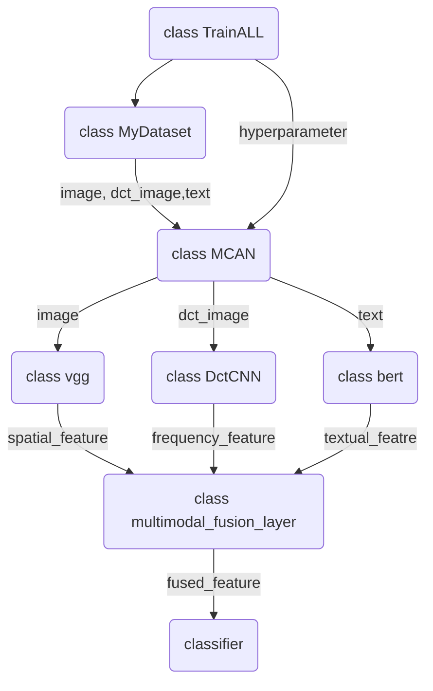

# MCAN
Multimodal Fusion with Co-Attention Networks for Fake news Detection
## Main Idea
One of the unique challenges for multimodal fake news detection on social media is how to fuse multimodal features. When reading news with image, people often observe image first and then read text. This process may be repeated several times, continuously fusing image and text information. Inspired by that, the MCAN is designed to learn inter-dependencies among all modalities to effectively fuse them, improving the performance of fake news detection.
## Architecture
First, we extract semantic-level and physical-level features of image, as well as textual features. Then we use a deep co-attention network to fuse them together, which consists of multiple co-attention layers. At last, the multimodal fused representation is used for judging the truth of the input news. 

# Data
The two datasets we used are public datasets, you can obtain the data from corresponding official links.  
[Twitter](http://www.multimediaeval.org/mediaeval2016/verifyingmultimediause/index.html)

1. Sort the images of the training set into corresponding folders according to labels.  
2. Use the select_data() function in data_process_twitter.py to extract information of post id, post content, image id list and label from the original data. And save them into a new txt file.  
3. Use get_data() function to read data of post id, post content, image and label.  
***
[Weibo](https://forms.gle/Hqzcv8DCy15JbeZW6)
1. Use the select_data() function in data_process_twitter.py to extract information of post id, post content, image id list and label from the original data. And save them into a new txt file.  
2. Use get_data() function to read data of post id, post content, image and label.

# Exteriment
The code of implementing the proposed model MCAN can be seen in MCAN.ipynb.
The main logic of the code is as follows:

## Requirements

You need to download [vgg-19](https://download.pytorch.org/models/vgg19-dcbb9e9d.pth) model and move it to current path (../MCAN_code/).

We train our model on Python 3.8.1. And your environment should have some packages as follows: 

- [ ] torch 1.5.0
- [ ] torchvision 0.6.0
- [ ] transformers 3.3.1
- [ ] scipy 1.5.2
- [ ] scikit-learn 0.23.2
- [ ] adabelief_pytorch 0.1.0
- [ ] ray 1.0.1
- [ ] tabulate 0.8.7

If you are insterested in this work, and want to use the codes or results in this repository, please star this repository and cite by:
    `@inproceedings{wu2021multimodal,
    title={Multimodal fusion with co-attention networks for fake news detection},
    author={Wu, Yang and Zhan, Pengwei and Zhang, Yunjian and Wang, Liming and Xu, Zhen},
    booktitle={Findings of the Association for Computational Linguistics: ACL-IJCNLP 2021},
    pages={2560--2569},
    year={2021}
    }`
